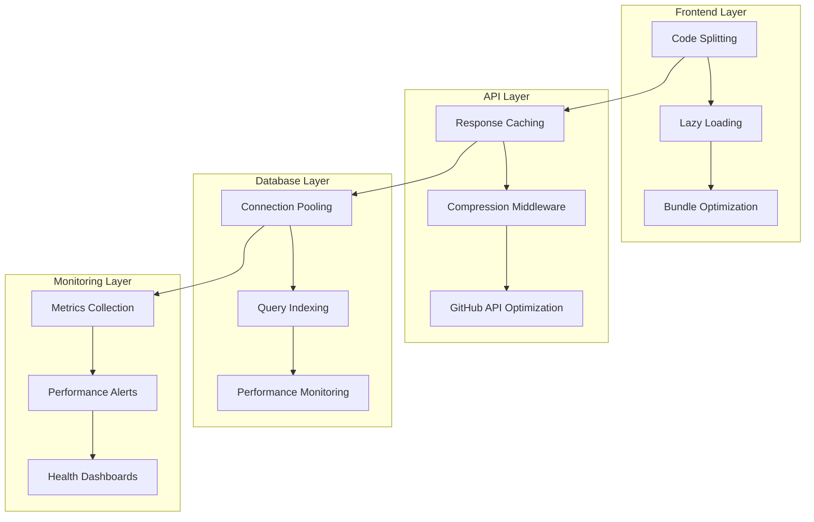

# Design Document

## Overview

This design outlines a comprehensive performance optimization system for RepoRadar that addresses three critical performance areas: database operations, API performance, and frontend delivery. The solution implements a layered approach with database indexing and connection pooling, API response caching and compression, GitHub API optimization, frontend code splitting and lazy loading, and comprehensive performance monitoring with graceful degradation strategies.

## Architecture

The performance optimization system follows a multi-tier architecture:



## Components and Interfaces

### Database Performance Components

**Connection Pool Manager**
- Interface: `IConnectionPool`
- Responsibilities: Manage database connection lifecycle, pool sizing, connection health
- Configuration: Min/max connections, idle timeout, connection validation

**Index Manager**
- Interface: `IIndexManager`
- Responsibilities: Create and maintain database indexes, monitor index usage
- Methods: `ensureIndexes()`, `analyzeQueryPerformance()`, `optimizeIndexes()`

**Query Performance Monitor**
- Interface: `IQueryMonitor`
- Responsibilities: Track query execution times, identify slow queries
- Metrics: Execution time, query frequency, index usage statistics

### API Performance Components

**Response Cache Manager**
- Interface: `ICacheManager`
- Responsibilities: Cache API responses, manage cache invalidation
- Storage: In-memory cache with Redis fallback for distributed scenarios
- TTL Strategy: Configurable per endpoint with smart invalidation

**Compression Middleware**
- Interface: `ICompressionMiddleware`
- Responsibilities: Compress API responses based on client capabilities
- Algorithms: Gzip (default), Brotli (when supported)
- Threshold: Compress responses > 1KB

**GitHub API Optimizer**
- Interface: `IGitHubOptimizer`
- Responsibilities: Batch requests, implement smart caching, manage rate limits
- Features: Request batching, conditional requests, rate limit backoff

### Frontend Performance Components

**Code Splitter**
- Interface: `ICodeSplitter`
- Responsibilities: Split application into loadable chunks
- Strategy: Route-based splitting with component-level granularity

**Lazy Loader**
- Interface: `ILazyLoader`
- Responsibilities: Defer component loading until needed
- Triggers: Route navigation, viewport intersection, user interaction

**Bundle Optimizer**
- Interface: `IBundleOptimizer`
- Responsibilities: Minimize bundle size through tree shaking and compression
- Tools: Vite optimization, dynamic imports, asset optimization

## Data Models

### Performance Metrics Model

```typescript
interface PerformanceMetrics {
  timestamp: Date;
  category: 'database' | 'api' | 'frontend';
  metric: string;
  value: number;
  threshold?: number;
  metadata?: Record<string, any>;
}

interface DatabaseMetrics extends PerformanceMetrics {
  category: 'database';
  queryId?: string;
  executionTime: number;
  connectionPoolSize: number;
  activeConnections: number;
}

interface APIMetrics extends PerformanceMetrics {
  category: 'api';
  endpoint: string;
  responseTime: number;
  cacheHit: boolean;
  compressionRatio?: number;
}

interface FrontendMetrics extends PerformanceMetrics {
  category: 'frontend';
  bundleName: string;
  loadTime: number;
  bundleSize: number;
  cacheStatus: 'hit' | 'miss' | 'stale';
}
```

### Cache Configuration Model

```typescript
interface CacheConfig {
  key: string;
  ttl: number;
  invalidationStrategy: 'time' | 'event' | 'manual';
  compressionEnabled: boolean;
  maxSize?: number;
}

interface CacheEntry {
  key: string;
  data: any;
  timestamp: Date;
  ttl: number;
  hits: number;
  size: number;
}
```

## Error Handling

### Database Error Handling

**Connection Pool Failures**
- Fallback: Direct database connections with connection limits
- Recovery: Automatic pool recreation with exponential backoff
- Monitoring: Connection health checks and pool size adjustments

**Query Performance Issues**
- Detection: Query execution time thresholds (>1000ms)
- Response: Automatic query plan analysis and index recommendations
- Fallback: Query timeout with partial results when possible

### API Error Handling

**Cache Failures**
- Fallback: Direct data retrieval without caching
- Recovery: Cache system restart with data preloading
- Monitoring: Cache hit rate tracking and alerting

**Compression Failures**
- Fallback: Uncompressed response delivery
- Recovery: Automatic compression algorithm fallback (Brotli → Gzip → None)
- Monitoring: Compression ratio tracking and failure rate alerts

**GitHub API Rate Limiting**
- Handling: Exponential backoff with jitter
- Fallback: Cached data serving with staleness indicators
- Recovery: Smart request queuing and priority management

### Frontend Error Handling

**Code Splitting Failures**
- Fallback: Synchronous component loading
- Recovery: Chunk reload with cache busting
- Monitoring: Chunk load success rates and failure patterns

**Lazy Loading Failures**
- Fallback: Immediate component rendering
- Recovery: Alternative loading strategies (preload, prefetch)
- Monitoring: Component load times and failure rates

## Testing Strategy

### Database Performance Testing

**Unit Tests**
- Connection pool management logic
- Index creation and optimization algorithms
- Query performance monitoring accuracy

**Integration Tests**
- Database connection pooling under load
- Index effectiveness with real queries
- Performance metric collection accuracy

**Load Tests**
- Connection pool behavior under high concurrency
- Database performance with optimized indexes
- Query performance degradation thresholds

### API Performance Testing

**Unit Tests**
- Cache management logic and invalidation
- Compression algorithm selection and fallback
- GitHub API optimization strategies

**Integration Tests**
- End-to-end caching behavior
- Compression middleware integration
- GitHub API rate limit handling

**Performance Tests**
- API response time improvements
- Cache hit rate optimization
- Compression ratio effectiveness

### Frontend Performance Testing

**Unit Tests**
- Code splitting configuration
- Lazy loading trigger logic
- Bundle optimization algorithms

**Integration Tests**
- Route-based code splitting
- Component lazy loading behavior
- Bundle size optimization results

**Performance Tests**
- Initial page load times
- Route navigation performance
- Bundle loading and caching behavior

### Monitoring and Alerting Tests

**Unit Tests**
- Metrics collection accuracy
- Alert threshold logic
- Performance degradation detection

**Integration Tests**
- End-to-end monitoring pipeline
- Alert delivery mechanisms
- Dashboard data accuracy

**Reliability Tests**
- Monitoring system resilience
- Graceful degradation behavior
- Recovery mechanism effectiveness