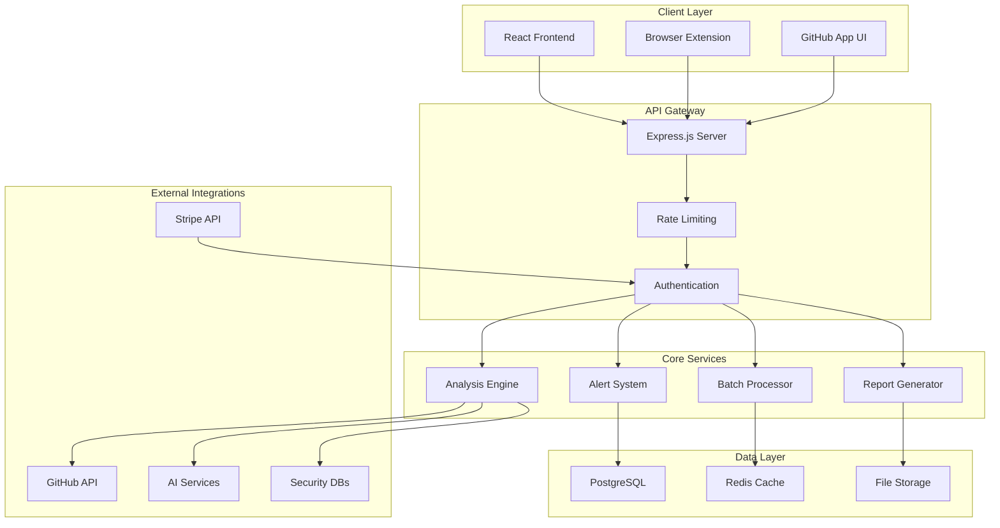
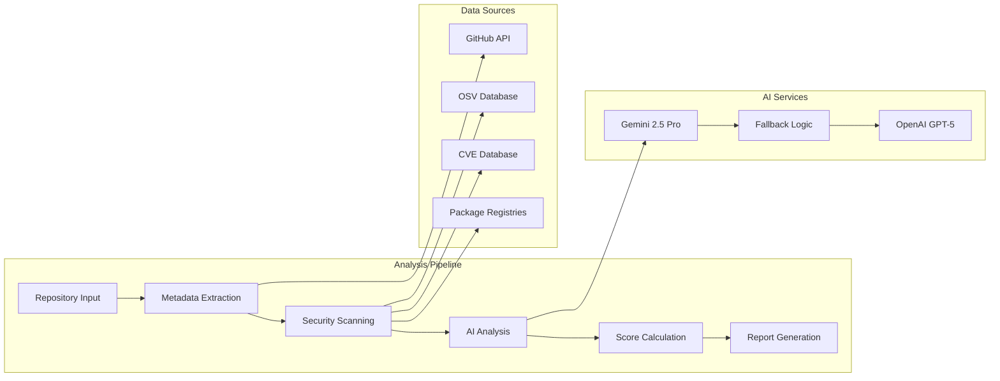

# Design Document

## Overview

This design document outlines the architecture and implementation approach for transforming RepoRadar into a comprehensive AI-powered repository intelligence platform. The design focuses on scalability, user experience, and monetization while maintaining the existing React/Express/PostgreSQL foundation.

## Architecture

### High-Level System Architecture



### Enhanced Analysis Engine Architecture



## Components and Interfaces

### 1. Enhanced Analysis Engine

**Purpose**: Core repository analysis with improved metrics and AI insights

**Key Components**:
- **Metadata Analyzer**: Extracts repository statistics, contributor patterns, and activity metrics
- **Security Scanner**: Checks for CVEs, outdated dependencies, and security best practices
- **AI Insight Generator**: Produces plain-English summaries and recommendations
- **Score Calculator**: Computes health, velocity, risk, and security scores

**Interfaces**:
```typescript
interface AnalysisRequest {
  repositoryUrl: string;
  depth: 'light' | 'comprehensive';
  includeSecurityScan: boolean;
  includeDependencyAnalysis: boolean;
}

interface AnalysisResult {
  health: {
    score: number;
    factors: HealthFactor[];
    summary: string;
  };
  velocity: {
    grade: string;
    releaseFrequency: number;
    prMergeTime: number;
    issueResponseTime: number;
  };
  risk: {
    level: 'low' | 'medium' | 'high';
    busFactorScore: number;
    maintainerRisk: string;
    factors: RiskFactor[];
  };
  security: {
    score: number;
    directCVEs: CVE[];
    transitiveCVEs: CVE[];
    dependencyFreshness: number;
  };
  recommendations: Recommendation[];
  plainEnglishSummary: string;
}
```

### 2. Professional Batch Analysis System

**Purpose**: Process multiple repositories with custom reporting and export capabilities

**Key Components**:
- **Queue Manager**: Handles concurrent analysis requests with priority queuing
- **Progress Tracker**: Real-time updates on batch processing status
- **Report Template Engine**: Generates custom reports for different audiences
- **Export Service**: Creates PDF and CSV exports with professional formatting

**Interfaces**:
```typescript
interface BatchAnalysisRequest {
  repositories: string[];
  reportTemplate: 'investor' | 'recruiter' | 'security' | 'custom';
  exportFormat: 'pdf' | 'csv' | 'json';
  customFields?: string[];
}

interface BatchAnalysisJob {
  id: string;
  status: 'queued' | 'processing' | 'completed' | 'failed';
  progress: {
    total: number;
    completed: number;
    failed: number;
    currentRepository?: string;
  };
  results: AnalysisResult[];
  reportUrl?: string;
}
```

### 3. Intelligent Alert System

**Purpose**: Proactive monitoring and notification for repository changes

**Key Components**:
- **Change Detector**: Monitors repositories for significant changes
- **Alert Engine**: Generates alerts based on configurable rules
- **Notification Service**: Delivers alerts via email, webhook, or in-app
- **Alert Manager**: User interface for managing alert preferences

**Interfaces**:
```typescript
interface AlertRule {
  id: string;
  repositoryPattern: string;
  triggers: AlertTrigger[];
  severity: 'low' | 'medium' | 'high' | 'critical';
  notificationMethods: NotificationMethod[];
}

interface Alert {
  id: string;
  repositoryUrl: string;
  type: 'security' | 'activity' | 'popularity' | 'maintenance';
  severity: 'low' | 'medium' | 'high' | 'critical';
  message: string;
  recommendations: string[];
  createdAt: Date;
  status: 'open' | 'acknowledged' | 'resolved';
}
```

### 4. GitHub Integration Platform

**Purpose**: Seamless integration with GitHub through app and browser extension

**Key Components**:
- **GitHub App Backend**: Handles OAuth, webhooks, and API integration
- **Browser Extension**: Lightweight overlay for GitHub pages
- **Sync Service**: Automatic repository data synchronization
- **Webhook Handler**: Processes GitHub events for real-time updates

**Browser Extension Architecture**:
```typescript
interface ExtensionMessage {
  type: 'analyze' | 'getCache' | 'updateSettings';
  payload: any;
}

interface GitHubOverlay {
  repositoryUrl: string;
  analysisData?: AnalysisResult;
  loading: boolean;
  error?: string;
}
```

### 5. Developer API Platform

**Purpose**: Programmatic access to repository analysis for third-party integrations

**Key Components**:
- **API Gateway**: Rate limiting, authentication, and request routing
- **SDK Generator**: Auto-generated client libraries for popular languages
- **Usage Analytics**: API usage tracking and billing integration
- **Documentation Portal**: Interactive API documentation with examples

**API Design**:
```typescript
// REST API Endpoints
POST /v1/analyze
GET /v1/repositories/{owner}/{repo}
POST /v1/batch-analyze
GET /v1/alerts
POST /v1/webhooks

// WebSocket Events
interface WebSocketEvent {
  type: 'analysis_complete' | 'alert_triggered' | 'batch_progress';
  data: any;
}
```

### 6. Subscription Management System

**Purpose**: Flexible pricing tiers with feature gating and billing integration

**Key Components**:
- **Subscription Service**: Manages user subscriptions and feature access
- **Usage Tracker**: Monitors API calls, analyses, and feature usage
- **Billing Integration**: Stripe integration for payment processing
- **Feature Gates**: Dynamic feature enabling based on subscription tier

**Subscription Tiers**:
```typescript
interface SubscriptionTier {
  name: 'free' | 'pro' | 'team' | 'enterprise';
  features: {
    monthlyAnalyses: number | 'unlimited';
    batchAnalysis: boolean;
    apiAccess: boolean;
    alerts: boolean;
    teamDashboard: boolean;
    sso: boolean;
    prioritySupport: boolean;
  };
  pricing: {
    monthly: number;
    annual: number;
  };
}
```

### 7. Enterprise Team Dashboard

**Purpose**: Organization-wide repository monitoring and team collaboration

**Key Components**:
- **Organization Manager**: Multi-tenant organization structure
- **Team Analytics**: Repository health trends and team metrics
- **SSO Integration**: Enterprise identity provider integration
- **Admin Controls**: User management and permission controls

**Dashboard Interfaces**:
```typescript
interface OrganizationDashboard {
  overview: {
    totalRepositories: number;
    averageHealth: number;
    openAlerts: number;
    teamMembers: number;
  };
  trends: {
    healthTrend: TimeSeriesData[];
    activityTrend: TimeSeriesData[];
    securityTrend: TimeSeriesData[];
  };
  repositories: RepositorySummary[];
  alerts: Alert[];
}
```

## Data Models

### Enhanced Database Schema

```sql
-- Enhanced repositories table
CREATE TABLE repositories (
  id SERIAL PRIMARY KEY,
  url VARCHAR(255) UNIQUE NOT NULL,
  owner VARCHAR(100) NOT NULL,
  name VARCHAR(100) NOT NULL,
  analysis_data JSONB,
  last_analyzed TIMESTAMP,
  analysis_version VARCHAR(20),
  created_at TIMESTAMP DEFAULT NOW(),
  updated_at TIMESTAMP DEFAULT NOW()
);

-- Subscription management
CREATE TABLE subscriptions (
  id SERIAL PRIMARY KEY,
  user_id INTEGER REFERENCES users(id),
  tier VARCHAR(20) NOT NULL,
  status VARCHAR(20) NOT NULL,
  stripe_subscription_id VARCHAR(100),
  current_period_start TIMESTAMP,
  current_period_end TIMESTAMP,
  created_at TIMESTAMP DEFAULT NOW()
);

-- Alert system
CREATE TABLE alerts (
  id SERIAL PRIMARY KEY,
  user_id INTEGER REFERENCES users(id),
  repository_url VARCHAR(255),
  type VARCHAR(50) NOT NULL,
  severity VARCHAR(20) NOT NULL,
  message TEXT NOT NULL,
  recommendations JSONB,
  status VARCHAR(20) DEFAULT 'open',
  created_at TIMESTAMP DEFAULT NOW()
);

-- Batch analysis jobs
CREATE TABLE batch_jobs (
  id SERIAL PRIMARY KEY,
  user_id INTEGER REFERENCES users(id),
  status VARCHAR(20) NOT NULL,
  progress JSONB,
  results JSONB,
  report_url VARCHAR(255),
  created_at TIMESTAMP DEFAULT NOW()
);

-- API usage tracking
CREATE TABLE api_usage (
  id SERIAL PRIMARY KEY,
  user_id INTEGER REFERENCES users(id),
  endpoint VARCHAR(100),
  method VARCHAR(10),
  response_time INTEGER,
  status_code INTEGER,
  created_at TIMESTAMP DEFAULT NOW()
);
```

### Caching Strategy

```typescript
interface CacheKey {
  type: 'analysis' | 'batch' | 'trending';
  identifier: string;
  version: string;
}

interface CachePolicy {
  ttl: number; // Time to live in seconds
  refreshThreshold: number; // Refresh when this old
  tags: string[]; // For cache invalidation
}

// Cache policies by data type
const CACHE_POLICIES = {
  analysis: { ttl: 3600, refreshThreshold: 1800, tags: ['repo'] },
  trending: { ttl: 900, refreshThreshold: 450, tags: ['trending'] },
  batch: { ttl: 7200, refreshThreshold: 3600, tags: ['batch'] }
};
```

## Error Handling

### Comprehensive Error Management

```typescript
enum ErrorCode {
  // Analysis errors
  REPOSITORY_NOT_FOUND = 'REPO_404',
  ANALYSIS_TIMEOUT = 'ANALYSIS_TIMEOUT',
  AI_SERVICE_UNAVAILABLE = 'AI_UNAVAILABLE',
  
  // API errors
  RATE_LIMIT_EXCEEDED = 'RATE_LIMIT',
  INVALID_SUBSCRIPTION = 'INVALID_SUB',
  QUOTA_EXCEEDED = 'QUOTA_EXCEEDED',
  
  // System errors
  DATABASE_ERROR = 'DB_ERROR',
  CACHE_ERROR = 'CACHE_ERROR',
  EXTERNAL_SERVICE_ERROR = 'EXT_SERVICE_ERROR'
}

interface ErrorResponse {
  code: ErrorCode;
  message: string;
  details?: any;
  retryAfter?: number;
  documentation?: string;
}
```

### Graceful Degradation Strategy

1. **AI Service Fallback**: Gemini → OpenAI → Basic metrics
2. **Cache Fallback**: Redis → Memory → Database
3. **Feature Degradation**: Full analysis → Light analysis → Cached results
4. **UI Fallback**: Real-time → Polling → Static display

## Testing Strategy

### Testing Pyramid

```typescript
// Unit Tests (70%)
describe('AnalysisEngine', () => {
  it('should calculate health score correctly');
  it('should handle AI service failures gracefully');
  it('should cache results appropriately');
});

// Integration Tests (20%)
describe('API Integration', () => {
  it('should process batch analysis end-to-end');
  it('should handle subscription tier changes');
  it('should deliver alerts correctly');
});

// E2E Tests (10%)
describe('User Workflows', () => {
  it('should complete repository analysis workflow');
  it('should handle subscription upgrade flow');
  it('should process batch analysis with exports');
});
```

### Performance Testing

```typescript
interface PerformanceTarget {
  endpoint: string;
  maxResponseTime: number;
  throughput: number;
  concurrency: number;
}

const PERFORMANCE_TARGETS = [
  { endpoint: '/api/analyze', maxResponseTime: 3000, throughput: 100, concurrency: 50 },
  { endpoint: '/api/batch-analyze', maxResponseTime: 30000, throughput: 10, concurrency: 5 },
  { endpoint: '/api/alerts', maxResponseTime: 500, throughput: 200, concurrency: 100 }
];
```

### Security Testing

- **Authentication**: JWT token validation and refresh
- **Authorization**: Role-based access control testing
- **Input Validation**: SQL injection and XSS prevention
- **Rate Limiting**: API abuse prevention
- **Data Privacy**: PII handling and GDPR compliance

## Implementation Phases

### Phase 1: Core Analysis Enhancement (4-6 weeks)
- Enhanced analysis engine with security scanning
- Improved scoring algorithms and plain-English summaries
- Basic alert system for security issues
- API foundation with rate limiting

### Phase 2: Professional Features (6-8 weeks)
- Batch analysis with queue management
- Custom report templates and export system
- Subscription management with Stripe integration
- Browser extension MVP

### Phase 3: Enterprise Platform (8-10 weeks)
- Team dashboard and organization management
- GitHub App with webhook integration
- Advanced alert system with custom rules
- SSO integration and admin controls

### Phase 4: Growth and Optimization (4-6 weeks)
- Performance optimization and caching improvements
- Content generation and trending features
- Advanced analytics and usage insights
- Mobile responsiveness and PWA features

## Security Considerations

### Data Protection
- **Encryption**: All sensitive data encrypted at rest and in transit
- **Access Control**: Role-based permissions with principle of least privilege
- **Audit Logging**: Comprehensive logging of all user actions and system events
- **Data Retention**: Configurable data retention policies with automatic cleanup

### API Security
- **Authentication**: JWT tokens with refresh mechanism
- **Rate Limiting**: Tiered rate limits based on subscription level
- **Input Validation**: Comprehensive validation using Zod schemas
- **CORS**: Strict CORS policies for browser-based requests

### Infrastructure Security
- **Environment Isolation**: Separate environments for development, staging, and production
- **Secret Management**: Secure storage and rotation of API keys and credentials
- **Network Security**: VPC configuration with private subnets for databases
- **Monitoring**: Real-time security monitoring and alerting

This design provides a comprehensive foundation for transforming RepoRadar into a professional repository intelligence platform while maintaining scalability, security, and user experience as core priorities.