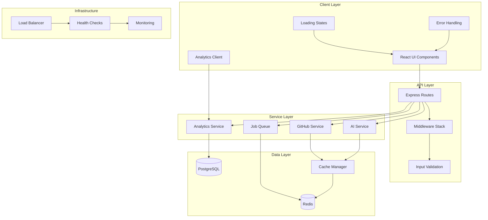

# Design Document - UX and Scalability Enhancements

## Overview

This design document outlines the technical approach for implementing Phase 3 enhancements to RepoRadar. Building on the solid foundation established in Phase 2 (Performance Optimization), this phase focuses on user experience improvements, code quality, operational monitoring, and horizontal scaling capabilities.

The design leverages the existing architecture while introducing new patterns for loading states, error handling, analytics, background processing, and multi-instance deployment. All enhancements are designed to be backward-compatible and incrementally deployable.

### Design Principles

1. **Progressive Enhancement** - Features degrade gracefully when dependencies are unavailable
2. **Performance First** - No feature should negatively impact existing performance metrics
3. **Accessibility by Default** - All UI components meet WCAG AA standards
4. **Scalability Ready** - Architecture supports horizontal scaling from day one
5. **Developer Experience** - Clean, maintainable code with strong type safety

---

## Architecture

### High-Level Architecture



### Component Interaction Flow

1. **User Request Flow**: Client → Load Balancer → API Instance → Service Layer → Data Layer
2. **Background Job Flow**: API → Job Queue (Redis) → Worker Process → Database
3. **Analytics Flow**: Client → Analytics Service → PostgreSQL (async)
4. **Health Check Flow**: Load Balancer → Health Endpoint → Dependency Checks → Status Response

### Scalability Architecture

The application supports horizontal scaling through:
- **Stateless API instances** - All session data stored in Redis
- **Shared cache layer** - Redis cluster for distributed caching
- **Job queue distribution** - Multiple workers can process jobs from shared queue
- **Database connection pooling** - Efficient connection management across instances

---

## Components and Interfaces

### 1. Loading State Components

#### LoadingSkeleton Component
```typescript
interface LoadingSkeletonProps {
  variant: 'card' | 'list' | 'table' | 'chart';
  count?: number;
  animate?: boolean;
}

// Provides reusable skeleton screens for different content types
```

#### ProgressIndicator Component
```typescript
interface ProgressIndicatorProps {
  progress: number; // 0-100
  status: 'loading' | 'processing' | 'complete' | 'error';
  message?: string;
  estimatedTime?: number; // seconds
}

// Shows progress for long-running operations
```

### 2. Error Handling Components

#### ErrorBoundary Component
```typescript
interface ErrorBoundaryProps {
  fallback: (error: Error, retry: () => void) => React.ReactNode;
  onError?: (error: Error, errorInfo: React.ErrorInfo) => void;
}

// Catches React errors and provides recovery UI
```

#### ErrorMessage Component
```typescript
interface ErrorMessageProps {
  error: AppError;
  onRetry?: () => void;
  onDismiss?: () => void;
  severity: 'error' | 'warning' | 'info';
}

interface AppError {
  code: string;
  message: string;
  userMessage: string;
  recoveryAction?: string;
  details?: Record<string, any>;
}

// Displays user-friendly error messages with recovery options
```

### 3. Analytics Service

#### Analytics Interface
```typescript
interface AnalyticsService {
  trackEvent(event: AnalyticsEvent): Promise<void>;
  trackError(error: Error, context: Record<string, any>): Promise<void>;
  trackPageView(page: string, metadata?: Record<string, any>): Promise<void>;
  setUserProperties(properties: Record<string, any>): void;
}

interface AnalyticsEvent {
  name: string;
  category: string;
  properties: Record<string, any>;
  timestamp: Date;
  userId?: string;
  sessionId: string;
}
```

#### Analytics Storage Schema
```sql
CREATE TABLE analytics_events (
  id UUID PRIMARY KEY,
  event_name VARCHAR(255) NOT NULL,
  event_category VARCHAR(100) NOT NULL,
  properties JSONB,
  user_id VARCHAR(255),
  session_id VARCHAR(255) NOT NULL,
  timestamp TIMESTAMP NOT NULL,
  created_at TIMESTAMP DEFAULT NOW()
);

CREATE INDEX idx_analytics_events_name ON analytics_events(event_name);
CREATE INDEX idx_analytics_events_timestamp ON analytics_events(timestamp);
CREATE INDEX idx_analytics_events_session ON analytics_events(session_id);
```

### 4. Background Job Queue

#### Job Queue Interface
```typescript
interface JobQueue {
  addJob<T>(jobType: string, data: T, options?: JobOptions): Promise<Job>;
  getJob(jobId: string): Promise<Job | null>;
  getJobStatus(jobId: string): Promise<JobStatus>;
  cancelJob(jobId: string): Promise<void>;
}

interface Job {
  id: string;
  type: string;
  data: any;
  status: JobStatus;
  progress: number;
  result?: any;
  error?: string;
  attempts: number;
  createdAt: Date;
  startedAt?: Date;
  completedAt?: Date;
}

type JobStatus = 'queued' | 'processing' | 'completed' | 'failed' | 'cancelled';

interface JobOptions {
  priority?: number;
  maxAttempts?: number;
  timeout?: number;
  delay?: number;
}
```

#### Job Processor Interface
```typescript
interface JobProcessor<T = any> {
  process(job: Job<T>): Promise<any>;
  onProgress?(progress: number): void;
  onComplete?(result: any): void;
  onError?(error: Error): void;
}
```

### 5. Health Check System

#### Health Check Interface
```typescript
interface HealthCheckService {
  checkHealth(): Promise<HealthStatus>;
  checkReadiness(): Promise<ReadinessStatus>;
  checkLiveness(): Promise<LivenessStatus>;
}

interface HealthStatus {
  status: 'healthy' | 'degraded' | 'unhealthy';
  timestamp: Date;
  checks: {
    database: CheckResult;
    cache: CheckResult;
    api: CheckResult;
    queue: CheckResult;
  };
}

interface CheckResult {
  status: 'up' | 'down' | 'degraded';
  responseTime: number;
  message?: string;
  details?: Record<string, any>;
}
```

### 6. Session Management

#### Session Store Interface
```typescript
interface SessionStore {
  get(sessionId: string): Promise<SessionData | null>;
  set(sessionId: string, data: SessionData, ttl: number): Promise<void>;
  delete(sessionId: string): Promise<void>;
  touch(sessionId: string, ttl: number): Promise<void>;
}

interface SessionData {
  userId?: string;
  createdAt: Date;
  lastAccessedAt: Date;
  data: Record<string, any>;
}
```

---

## Data Models

### Analytics Event Model
```typescript
class AnalyticsEvent {
  id: string;
  name: string;
  category: string;
  properties: Record<string, any>;
  userId?: string;
  sessionId: string;
  timestamp: Date;
  
  constructor(data: Partial<AnalyticsEvent>);
  validate(): boolean;
  anonymize(): AnalyticsEvent;
}
```

### Job Model
```typescript
class Job<T = any> {
  id: string;
  type: string;
  data: T;
  status: JobStatus;
  progress: number;
  result?: any;
  error?: string;
  attempts: number;
  maxAttempts: number;
  createdAt: Date;
  startedAt?: Date;
  completedAt?: Date;
  
  constructor(type: string, data: T, options?: JobOptions);
  updateProgress(progress: number): void;
  markComplete(result: any): void;
  markFailed(error: Error): void;
  canRetry(): boolean;
}
```

### Error Model
```typescript
class AppError extends Error {
  code: string;
  userMessage: string;
  recoveryAction?: string;
  details?: Record<string, any>;
  statusCode: number;
  
  constructor(code: string, message: string, userMessage: string);
  toJSON(): object;
  static fromError(error: Error): AppError;
}
```

---

## Error Handling

### Error Classification

Errors are classified into categories for appropriate handling:

1. **User Errors** (4xx)
   - Invalid input
   - Authentication failures
   - Resource not found
   - Rate limiting

2. **System Errors** (5xx)
   - Database connection failures
   - External API failures
   - Internal server errors
   - Timeout errors

3. **Network Errors**
   - Connection timeouts
   - DNS failures
   - SSL errors

### Error Handling Strategy

```typescript
// Centralized error handler
class ErrorHandler {
  handle(error: Error, context: ErrorContext): AppError {
    // Log error with context
    logger.error(error, context);
    
    // Track error in analytics
    analytics.trackError(error, context);
    
    // Convert to user-friendly error
    const appError = this.convertToAppError(error);
    
    // Determine recovery action
    appError.recoveryAction = this.getRecoveryAction(appError);
    
    return appError;
  }
  
  private convertToAppError(error: Error): AppError {
    if (error instanceof AppError) return error;
    
    // Map known errors to user-friendly messages
    if (error.message.includes('rate limit')) {
      return new AppError(
        'RATE_LIMIT_EXCEEDED',
        error.message,
        'GitHub API rate limit exceeded. Please try again later.'
      );
    }
    
    // Default error
    return new AppError(
      'UNKNOWN_ERROR',
      error.message,
      'An unexpected error occurred. Please try again.'
    );
  }
  
  private getRecoveryAction(error: AppError): string {
    const recoveryActions: Record<string, string> = {
      'RATE_LIMIT_EXCEEDED': 'Wait for rate limit to reset or use authentication',
      'NETWORK_ERROR': 'Check your internet connection and retry',
      'INVALID_INPUT': 'Please check your input and try again',
      'NOT_FOUND': 'Verify the repository exists and is accessible',
    };
    
    return recoveryActions[error.code] || 'Please try again or contact support';
  }
}
```

### Retry Logic

```typescript
class RetryHandler {
  async executeWithRetry<T>(
    fn: () => Promise<T>,
    options: RetryOptions = {}
  ): Promise<T> {
    const {
      maxAttempts = 3,
      backoff = 'exponential',
      initialDelay = 1000,
      maxDelay = 10000,
    } = options;
    
    let lastError: Error;
    
    for (let attempt = 1; attempt <= maxAttempts; attempt++) {
      try {
        return await fn();
      } catch (error) {
        lastError = error as Error;
        
        if (attempt === maxAttempts || !this.isRetryable(error)) {
          throw error;
        }
        
        const delay = this.calculateDelay(attempt, backoff, initialDelay, maxDelay);
        await this.sleep(delay);
      }
    }
    
    throw lastError!;
  }
  
  private isRetryable(error: any): boolean {
    // Network errors are retryable
    if (error.code === 'ECONNRESET' || error.code === 'ETIMEDOUT') {
      return true;
    }
    
    // 5xx errors are retryable
    if (error.statusCode >= 500) {
      return true;
    }
    
    // Rate limit errors are not retryable
    if (error.statusCode === 429) {
      return false;
    }
    
    return false;
  }
  
  private calculateDelay(
    attempt: number,
    backoff: 'linear' | 'exponential',
    initialDelay: number,
    maxDelay: number
  ): number {
    if (backoff === 'exponential') {
      return Math.min(initialDelay * Math.pow(2, attempt - 1), maxDelay);
    }
    return Math.min(initialDelay * attempt, maxDelay);
  }
  
  private sleep(ms: number): Promise<void> {
    return new Promise(resolve => setTimeout(resolve, ms));
  }
}
```

---

## Testing Strategy

### Unit Testing

1. **Component Testing**
   - Test loading states render correctly
   - Test error messages display appropriate content
   - Test accessibility attributes are present
   - Test mobile responsive behavior

2. **Service Testing**
   - Test analytics events are tracked correctly
   - Test job queue operations
   - Test error handling and retry logic
   - Test health check responses

3. **Utility Testing**
   - Test error classification
   - Test retry logic with various scenarios
   - Test session management operations

### Integration Testing

1. **API Integration**
   - Test error handling across API endpoints
   - Test analytics tracking in request flow
   - Test job queue integration
   - Test health check endpoints

2. **Database Integration**
   - Test analytics event storage
   - Test session persistence
   - Test connection pooling

3. **Cache Integration**
   - Test Redis session storage
   - Test job queue operations
   - Test cache invalidation

### End-to-End Testing

1. **User Flows**
   - Test complete repository analysis with loading states
   - Test error recovery flows
   - Test mobile navigation and interactions
   - Test keyboard navigation

2. **Scalability Testing**
   - Test multiple instances sharing session state
   - Test job processing across multiple workers
   - Test load balancer health checks

### Accessibility Testing

1. **Automated Testing**
   - Run Lighthouse accessibility audits
   - Use axe-core for automated checks
   - Test keyboard navigation paths

2. **Manual Testing**
   - Test with screen readers (NVDA, JAWS, VoiceOver)
   - Test keyboard-only navigation
   - Test with browser zoom at 200%

### Performance Testing

1. **Load Testing**
   - Test with 100 concurrent users
   - Test job queue with 100 concurrent jobs
   - Test analytics with 1000 events/minute

2. **Stress Testing**
   - Test graceful degradation under load
   - Test recovery after failures
   - Test memory usage over time

---

## Implementation Notes

### Phase 1: UX Improvements (Week 1)

1. **Loading States** - Implement skeleton screens and progress indicators
2. **Error Handling** - Create error boundary and user-friendly messages
3. **Mobile Responsiveness** - Adapt layouts for mobile devices
4. **Accessibility** - Add ARIA labels, keyboard navigation, focus management
5. **Code Quality** - Remove `any` types, clean up unused code, reduce duplication

### Phase 2: Analytics and Scalability (Week 2)

1. **Analytics** - Implement event tracking and storage
2. **Admin Dashboard** - Create monitoring interface
3. **Background Jobs** - Implement job queue with Redis
4. **Horizontal Scaling** - Move sessions to Redis, add health checks
5. **Testing** - Comprehensive test coverage for all new features

### Technology Choices

- **Job Queue**: BullMQ (Redis-based, robust, well-maintained)
- **Session Store**: connect-redis (Express-compatible, reliable)
- **Analytics Storage**: PostgreSQL (existing database, good for structured data)
- **Health Checks**: Custom implementation (lightweight, Kubernetes-compatible)
- **Loading States**: Custom React components (full control, no dependencies)

### Migration Strategy

All changes are backward-compatible and can be deployed incrementally:

1. Deploy loading states and error handling (no breaking changes)
2. Deploy analytics system (opt-in, no impact on existing features)
3. Deploy Redis for sessions (graceful fallback to memory store)
4. Deploy job queue (new feature, no impact on existing flows)
5. Deploy health checks (new endpoints, no impact on existing routes)

### Monitoring and Observability

- **Metrics**: Track response times, error rates, job processing times
- **Logging**: Structured logging with correlation IDs
- **Alerts**: Set up alerts for error rate spikes, slow responses, failed jobs
- **Dashboards**: Create Grafana dashboards for key metrics

---

## Security Considerations

1. **Analytics Privacy**
   - Anonymize user data before storage
   - Provide opt-out mechanism
   - Comply with GDPR/CCPA requirements

2. **Admin Dashboard**
   - Require authentication for access
   - Implement role-based access control
   - Audit log for admin actions

3. **Session Security**
   - Encrypt session data in Redis
   - Use secure session IDs
   - Implement session timeout

4. **Health Checks**
   - Don't expose sensitive information
   - Rate limit health check endpoints
   - Validate health check requests

---

## Performance Considerations

1. **Loading States**
   - Render skeletons immediately (< 100ms)
   - Use CSS animations for smooth transitions
   - Avoid layout shifts during loading

2. **Analytics**
   - Track events asynchronously
   - Batch events for efficient storage
   - Use connection pooling for database

3. **Job Queue**
   - Process jobs in parallel with worker pool
   - Implement job prioritization
   - Monitor queue depth and processing times

4. **Scalability**
   - Use Redis cluster for high availability
   - Implement connection pooling
   - Monitor resource usage per instance

---

## Rollback Strategy

If issues arise during deployment:

1. **Loading States/Error Handling**: Feature flags to disable new UI
2. **Analytics**: Stop event tracking, no data loss
3. **Job Queue**: Drain queue, process remaining jobs, disable new jobs
4. **Session Store**: Fallback to memory store (sessions will be lost)
5. **Health Checks**: Remove from load balancer configuration

All features include feature flags for quick rollback without redeployment.
